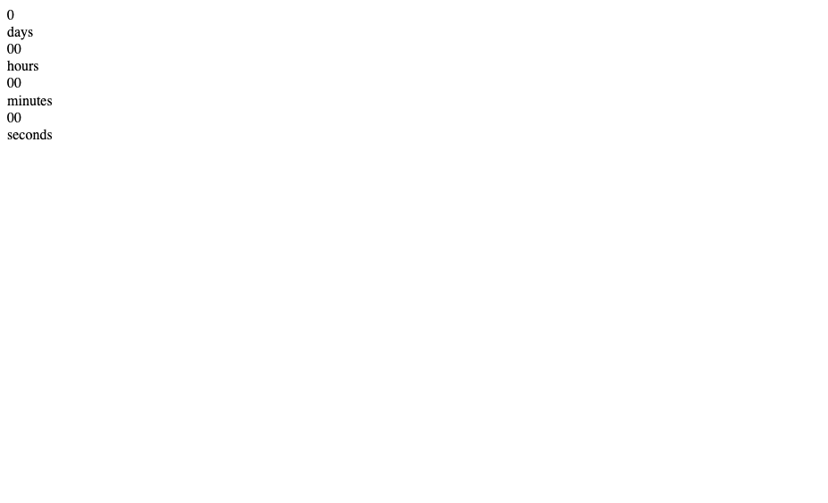
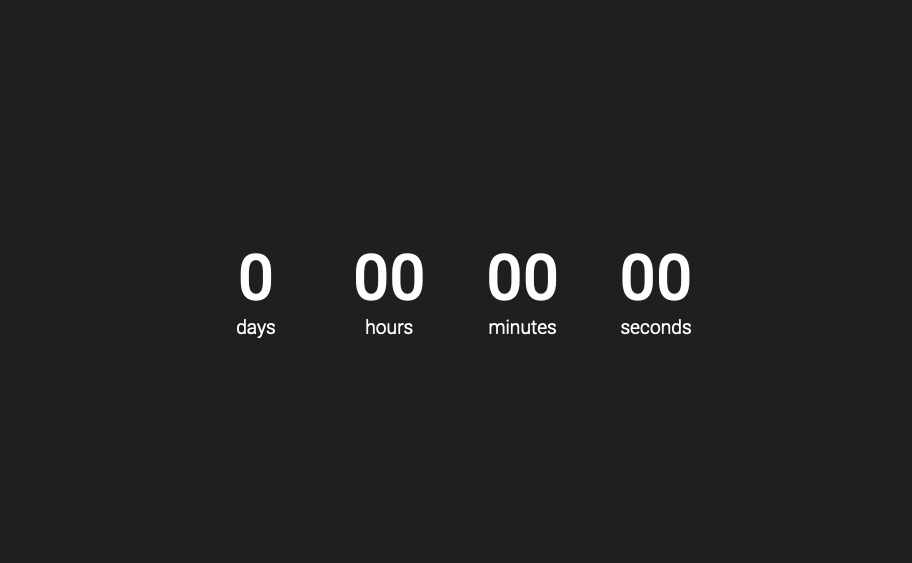
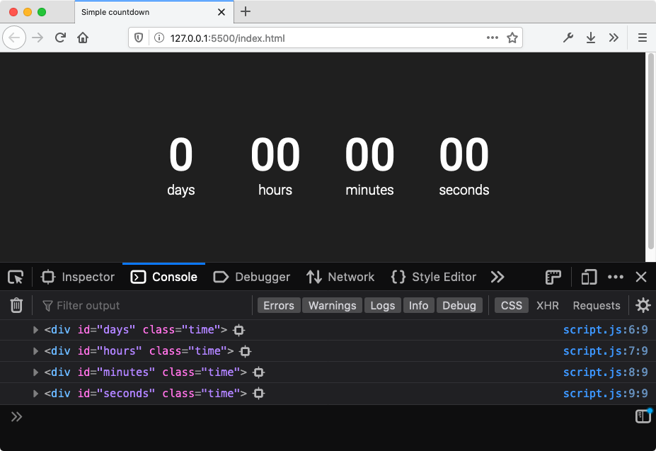
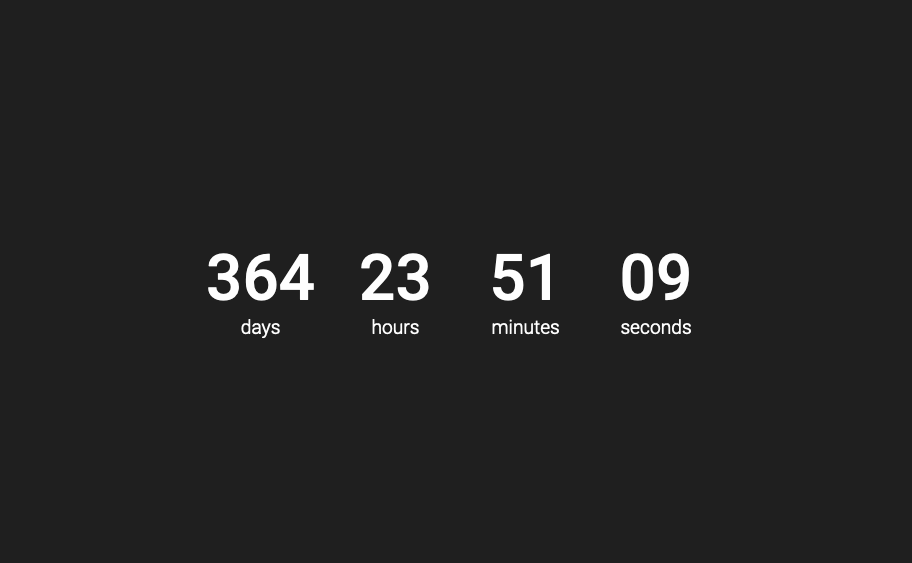
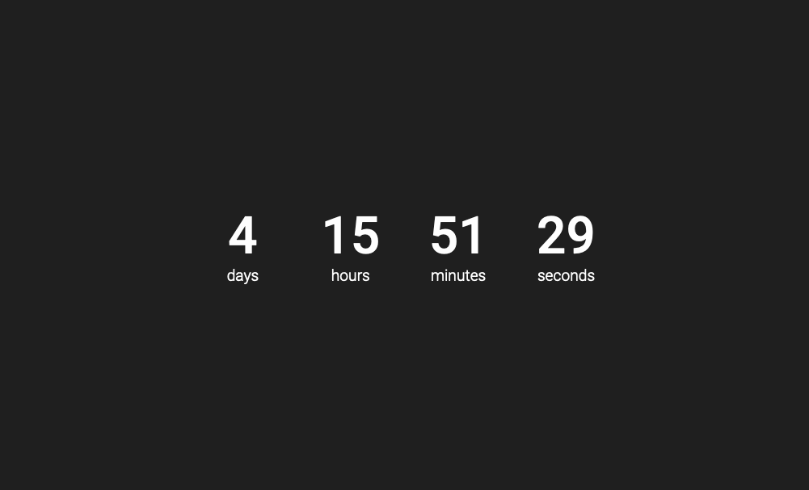

Exam season is upon us, and deadlines are looming closer and closer.
It is often hard to keep track of just how close they are, and sometimes we need a reminder.
Let's make one with JavaScript.

The inspiration for this came from a Norwegian news article counting down the days, hours, minutes and seconds until [bars were allowed to reopen after the COVID-19 lockdown](https://www.nrk.no/osloogviken/oslo-apner-skjenkingen-1.15001011).

You can see a [live demo](https://jakobsen.github.io/countdown-timer/) of what we'll be making, counting down until new year's eve. The source code is as always available on [Github](https://github.com/jakobsen/countdown-timer/). Note that the code is slightly modified to automatically set the correct year, but it is otherwise identical to what we'll write in this post.

## Set up the project

Make a folder for your project, and create three files. I'll do it using the terminal, you can of course do it however you want.

```shell
mkdir countdown-timer
cd countdown-timer
touch index.html style.css script.js
```

## HTML & CSS

The HTML and CSS for this project are pretty simple. This main idea for the HTML is to create a container for our entire timer. Each ticker and it's label will be together in a `html›<div />` to easily space them out. Finally, we put each ticker in a `html›<div />` and it's label in a `html›<span />` so we can easily grab onto them with both JavaScript and CSS.

The `html›<body />` of my HTML document looks like this:

```html:title=index.html
<div class="countdown">
  <div class="box">
    <div class="time" id="days">0</div>
    <span class="label">days</span>
  </div>
  <div class="box">
    <div class="time" id="hours">00</div>
    <span class="label">hours</span>
  </div>
  <div class="box">
    <div class="time" id="minutes">00</div>
    <span class="label">minutes</span>
  </div>
  <div class="box">
    <div class="time" id="seconds">00</div>
    <span class="label">seconds</span>
  </div>
</div>
<script src="script.js"></script>
```

Note that we're also including our (for now empty) script in the final line. We'll use that to change the inner text of the `html›<div class="time" />` elements, which for now are just all set to zero.

This is what our website now looks like:


It looks pretty terrible, so let's fix that. First, link our stylesheet with a `html›<link />` tag in the `html›<head />` of `index.html`. I also chose to import the popular Roboto font from Google Fonts. This is what's between the `html›<head />` tags in my HTML file:

```html
<meta charset="UTF-8" />
<meta name="viewport" content="width=device-width, initial-scale=1.0" />
<link
  href="https://fonts.googleapis.com/css2?family=Roboto:wght@300;500&display=swap"
  rel="stylesheet"
/>
<link rel="stylesheet" href="style.css" />
<title>Simple countdown</title>
```

There's also two `html›<meta />` tags, put there by VS Code, my text editor. The first lets the browser know we are using the UTF-8 text encoding, whilst the second makes sure the site is properly scaled on mobile screens.

This is the complete HTML file:

```html
<!DOCTYPE html>
<html lang="en">
  <head>
    <meta charset="UTF-8" />
    <meta name="viewport" content="width=device-width, initial-scale=1.0" />
    <link
      href="https://fonts.googleapis.com/css2?family=Roboto:wght@300;500&display=swap"
      rel="stylesheet"
    />
    <link rel="stylesheet" href="style.css" />
    <title>Simple countdown</title>
  </head>
  <body>
    <div class="countdown">
      <div class="box">
        <div class="time" id="days"></div>
        <span class="label">days</span>
      </div>
      <div class="box">
        <div class="time" id="hours"></div>
        <span class="label">hours</span>
      </div>
      <div class="box">
        <div class="time" id="minutes"></div>
        <span class="label">minutes</span>
      </div>
      <div class="box">
        <div class="time" id="seconds"></div>
        <span class="label">seconds</span>
      </div>
    </div>

    <script src="script.js"></script>
  </body>
</html>
```

We'll give the site a dark background and make the text white. We want the counter to be centered on the page, both vertically and horizontally. To achieve this, give the body a height, make it a flexbox, and use both the `css›justify-content` and `css›align-items` properties. We also set `css›margin: 0` so we don't get a scrollbar in some browsers.

We use the universal selector `css›*` and apply `css›box-sizing: border-box;` to ensure that any `border` and `padding` will be included when the browser calculates the height and width of an element.

```css:title=style.css
* {
  box-sizing: border-box;
}

body {
  color: #fefefe;
  background-color: #222;
  margin: 0;
  min-height: 100vh;
  display: flex;
  justify-content: center;
  align-items: center;
  font-family: 'Roboto', sans-serif;
}
}
```

We want the different tickers in a single row, with equal spacing between them. Again, flexbox is my preferred way of doing it.

```css:title=style.css
.countdown {
  width: 500px;
  display: flex;
  justify-content: space-between;
}
```

Finally, we'll add some rules so that the boxes don't change in width when the numbers tick down, center the text, and set some font sizes.

```css:title=style.css
.box {
  text-align: center;
  min-width: 100px;
}

.time {
  font-size: 4rem;
  font-weight: 500;
}

.label {
  font-size: 1.2rem;
  font-weight: 300;
}
```

The complete CSS file is now

```css:title=style.css
* {
  box-sizing: border-box;
}

body {
  color: #fefefe;
  background-color: #222;
  margin: 0;
  min-height: 100vh;
  display: flex;
  justify-content: center;
  align-items: center;
  font-family: "Roboto", sans-serif;
}

.countdown {
  width: 500px;
  display: flex;
  justify-content: space-between;
}

.box {
  text-align: center;
  min-width: 100px;
}

.time {
  font-size: 4rem;
  font-weight: 500;
}

.label {
  font-size: 1.2rem;
  font-weight: 300;
}
```

and our site looks a lot better:



It's time to make it tick.

## JavaScript

The first thing we'll do in `script.js` is to create variables for each of our ticker elements.

```js:title=script.js
const days = document.getElementById("days");
const hours = document.getElementById("hours");
const minutes = document.getElementById("minutes");
const seconds = document.getElementById("seconds");
```

To make sure I haven't done a silly mistake like make a typo, I like to `js›console.log()` all of my newly defined variables.

```js:title=script.js
console.log(days);
console.log(hours);
console.log(minutes);
console.log(seconds);
```

If you open your console, you should see something like this:



It may look a little different, depending on your browser. As long as it doesn't say `js›null`, you're alright. When you have confirmed that you have defined the variables correctly, remove the `console.log()` statements.

This is our plan for what to do next:

1. Define a function that accepts a [`Date` object](https://developer.mozilla.org/en-US/docs/Web/JavaScript/Reference/Global_Objects/Date) as a parameter and returns the days, hours, minutes and seconds remaining until that date.
2. Define a function that accepts a `Date` object, uses the previous function to get the values we need for our tickers, and updates the `js›innerText` to display the correct value.
3. Call our function every second to get a countdown.

To complete our first objective, we will use the `js›Date.now()` method.
This gives us the number of milliseconds elapsed since [January 1, 1970](https://en.wikipedia.org/wiki/Unix_time).
We can get the corresponding value for an arbitrary date `js›myDate` by calling `js›myDate.getTime()`.

So the start of our function will be

```js:title=script.js
const getTimeDifference = (targetDate) => {
  const diff = targetDate.getTime() - Date.now();
};
```

The variable `diff` will hold the number of milliseconds between now and whenever `targetDate` is. Note that if `targetDate` is set to some date in the past (which will happen at some point, anyway), this value will be negative. In that case, the countdown timer should just display zeros. We implement this with an `js›if`-statement.

```js:title=script.js
const getTimeDifference = (targetDate) => {
  let diff = targetDate.getTime() - Date.now();

  if (diff < 0) {
    return {
      days: 0,
      hours: 0,
      minutes: 0,
      seconds: 0,
    };
  }
};
```

We return an `js›Object` to make it easier to unpack the values when we call the function.

Next, we'll use a bit of math to convert milliseconds remaining into something a bit more human-friendly. We'll use `js›Math.floor()` and the modulo operator, both of which you might or might not be familiar with.

The method `Math.floor()` accepts a number as an argument, and returns the biggest integer that is smaller than or equal to this number. For positive numbers, this means it removes anything that comes after the decimal point.

```js
Math.floor(2.3); // 2
Math.floor(199.9999999); // 199
Math.floor(4); // 4
```

The modulo operator `%` returns the remainder after performing whole-number division. For instance, if you divide 5 by 2 you get 2, with a remainder of 1, so `js›5 % 2 == 1`. Some more examples:

```js
11 % 4; // 3
4 % 11; // 4
6 % 3; // 0
```

To get the correct number of whole days remaining, divide the number of milliseconds remaining by the number of milliseconds in a day, and round down to the nearest integer.

```js
const days = Math.floor(diff / (1000 * 60 * 60 * 24));
```

Of course, we can do a similar calculation for hours, minutes and seconds. However, this will include the number of days remaining as well—for instance, if we are counting down to a time 1 day and 1 hour away, this would calculate that there are 1 days and 25 hours remaining. We fix it with the modulo `%` operator, only giving us the remainder after we have removed the corresponding days, hours, and minutes down the line:

```js
const days = Math.floor(diff / (1000 * 60 * 60 * 24));
const hours = Math.floor(diff / (1000 * 60 * 60)) % 24;
const minutes = Math.floor(diff / (1000 * 60)) % 60;
const seconds = Math.floor(diff / 1000) % 60;
```

Now all that remains is to `js›return` our values, and our function is done.

```js:title=script.js
const getTimeDifference = (targetDate) => {
  let diff = targetDate.getTime() - Date.now();

  if (diff < 0) {
    return {
      days: 0,
      hours: 0,
      minutes: 0,
      seconds: 0,
    };
  }

  const days = Math.floor(diff / (1000 * 60 * 60 * 24));
  const hours = Math.floor(diff / (1000 * 60 * 60)) % 24;
  const minutes = Math.floor(diff / (1000 * 60)) % 60;
  const seconds = Math.floor(diff / 1000) % 60;

  return { days, hours, minutes, seconds };
};
```

Let's make another function to update the timer on our site. This is pretty straightforward: We get the correct values using `js›getTimeDifference()`, and then update the `.innerText` for the corresponding HTML elements.

```js:title=script.js
const updateTime = (targetDate) => {
  const { days, hours, minutes, seconds } = getTimeDifference(targetDate);
  daysElement.innerText = days;
  hoursElement.innerText = hours;
  minutesElement.innerText = minutes;
  secondsElement.innerText = seconds;
};
```

In the second line we use [object destructuring](https://developer.mozilla.org/en-US/docs/Web/JavaScript/Reference/Operators/Destructuring_assignment#Object_destructuring), a great syntax feature in JavaScript that allows us to assign several variables at once from an object.

At this point we can test our function. Let's define a date that is a year from now and call our function, to make sure it works. Add the following lines to then end of `script.js`(feel free to change the date):

```js:title=script.js
const targetDate = new Date("2021-05-06 16:30:00");
updateTime(targetDate);
```

You should see something like this:


It works! However, I'd prefer any single digit value for hours, minutes or seconds to start with a leading zero. We can do this by combining the JavaScript methods `js›.toString()` and `js›.padStart()`. [The latter](https://developer.mozilla.org/en-US/docs/Web/JavaScript/Reference/Global_Objects/String/padStart) is a prototype method of strings, so we first need to convert our numeric values to strings using [the former](https://developer.mozilla.org/en-US/docs/Web/JavaScript/Reference/Global_Objects/Object/toString). If you want, edit your function so that it looks like this:

```js:title=script.js
const updateTime = (targetDate) => {
  const { days, hours, minutes, seconds } = getTimeDifference(targetDate);
  daysElement.innerText = days;
  hoursElement.innerText = hours.toString().padStart(2, "0");
  minutesElement.innerText = minutes.toString().padStart(2, "0");
  secondsElement.innerText = seconds.toString().padStart(2, "0");
};
```

The first argument to `.padStart()` is the minimum length of the string. The second argument is the character to use to increase it (if necessary) until it reaches this length. Our countdown timer now looks like this:



Finally, we need to update the timer every second. Luckily, there is a [built-in method called `js›setInterval()`](https://developer.mozilla.org/en-US/docs/Web/API/WindowOrWorkerGlobalScope/setInterval) which lets us do just that.

Edit `script.js` so it ends with the following three lines:

```js:title=script.js
const targetDate = new Date("2021-05-06 16:30:00");
updateTime(targetDate);
setInterval(updateTime, 1000, targetDate);
```

In `js›setInterval()` the first argument is the function to execute every time, and the second argument is the delay between each execution in milliseconds. Any following arguments will be passed as arguments to the function, so we pass `js›targetDate` as a third argument.

> Note that passing arguments to the callback function in `js›setInterval()` is not supported in Internet Explorer 9 and lower. If you need to support these browsers, Mozilla Developer Network suggest a [number of workarounds](https://developer.mozilla.org/en-US/docs/Web/API/WindowOrWorkerGlobalScope/setInterval#Callback_arguments). The most obvious one in our case is to include the `targetDate` as a local variable inside the definition of `updateTime`.

The complete `script.js` file is now

```js:title=script.js
const daysElement = document.getElementById("days");
const hoursElement = document.getElementById("hours");
const minutesElement = document.getElementById("minutes");
const secondsElement = document.getElementById("seconds");

const getTimeDifference = (targetDate) => {
  let diff = targetDate.getTime() - Date.now();

  if (diff < 0) {
    return {
      days: 0,
      hours: 0,
      minutes: 0,
      seconds: 0,
    };
  }

  const days = Math.floor(diff / (1000 * 60 * 60 * 24));
  const hours = Math.floor(diff / (1000 * 60 * 60)) % 24;
  const minutes = Math.floor(diff / (1000 * 60)) % 60;
  const seconds = Math.floor(diff / 1000) % 60;

  return { days, hours, minutes, seconds };
};

const updateTime = (targetDate) => {
  const { days, hours, minutes, seconds } = getTimeDifference(targetDate);
  daysElement.innerText = days;
  hoursElement.innerText = hours.toString().padStart(2, "0");
  minutesElement.innerText = minutes.toString().padStart(2, "0");
  secondsElement.innerText = seconds.toString().padStart(2, "0");
};
const targetDate = new Date("2021-05-06 16:30:00");
updateTime(targetDate);
setInterval(updateTime, 1000, targetDate);
```

Note that we both call `js›updateTime()` directly and inside `js›setInterval()`. If we only did it with `js›setInterval()` it would take a second to update the webpage, and it would look like our countdown was frozen at 0.

If you save this file and open up `index.html` with a browser, you should see a timer ticking! When I set it to my exam date and open it up, I see the following:



I really should get back to studying.
