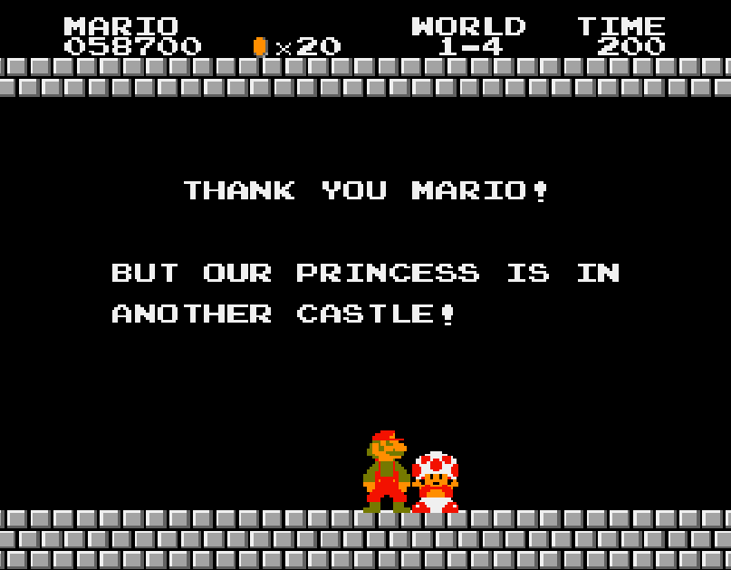

import { Link } from "gatsby";

After I had been learning to program for a couple of weeks, I was feeling pretty good about myself.
I had figured out how to define a function.
I knew how to pass arguments when calling my function, making it flexible enough to handle values as they were changing throughout my program.
I had even figured out how to write a loop, and I could use `py›if` statements to control the flow of my program.
Life was good.

Then recursion entered stage left and made my life miserable.

It just didn't make any sense.
I understood what it meant for a function to call _another_ function, but a function calling itself was just ridiculous.

Luckily, at some point, I connected the dots.
And that is when I realized that recursion doesn't exist to make life hard.
It exists to make life easy.

Let's get started.

## To understand recursion, you must first understand recursion

In short, a recursive function is one that calls itself.
This Python function is recursive:

```py
def stupid_function(n):
    return stupid_function(n-1)
```

This particular function is worthless.
I'm not saying that to make it feel bad, it simply does nothing.
It will keep calling itself over and over again, until society collapses or your computer crashes.
Whilst this is a completely valid example of a recursive function, it is only a demonstration of the definition, and it doesn't bring us any closer to understanding what recursion is good for.

This one is a little better:

```py
def mystery(n):
    if n == 0:
        return 0
    return 2 + mystery(n - 1)
```

Let's go through it, line by line.
The first thing it does is check if `py›n` is zero.
If it is, don't even bother doing anything: Just `py›return 0` in the second line and call it a day.
The final line is where it gets interesting:
If `py›n` is anything other than `py›0`, figure out what `py›mystery(n-1)` is and add `py›2` to that.

For this to ever stop, `py›n` has to be a non-negative [integer](https://en.wikipedia.org/wiki/Integer).
If you write the above into your code editor and then try running `py›mystery(-1)`, we're back to the whole wait-for-your-computer-to-crash thing.

Let's try to figure out what this function does when given something sensible as an argument, say `py›1`.
Imagine being the computer, and you're told to execute `py›mystery(1)`.
First, you check whether or not `py›1` is `py›0`.
You triumphantly declare that it is, in fact, not, and continue.
To your dismay, you realize you have to start over, because your next instruction is to figure out what `py›2 + mystery(0)` is.



Starting again from the top, you check if `py›0` is `py›0`, and would you know, it is!
That means `py›mystery(0)` equals `py›0`, and _that_ means `py›mystery(1)` is `py›2 + 0`, which of course is `py›2`.

Let's try one more. We'll be bold and skip straight to figuring out `py›mystery(3)` this time.
Since `py›3` isn't `py›0`, we find that it is `py›2 + mystery(2)`.
That means we'll have to figure out what `py›mystery(2)` is, and then add `py›2` to that to find `py›mystery(3)`.
Similarly, `py›mystery(2)` equals `py›2 + mystery(1)`.
This time, we're in luck—we already figured out `py›mystery(1)`, and we know that it is equal to `py›2`.
Plugging this in, we then work backwards to arrive at our original answer:
`py›mystery(2)` is `py›2 + 2`, i.e. `py›4`.
Then `py›mystery(3)` is `py›2 + 4`, which makes `py›6`. We figured it out!

At this point, you might have figured out that `py›mystery(n)` is an overly complicated way of calculating two times `py›n`.

Let's read the algorithm again, but this time, we'll read it with a different mindset.

Imagine that we are tasked with writing a program that calculates two times `py›n` for whole numbers that are bigger than or equal to `py›0`.
This strikes us as pretty difficult. We have no idea what two times `py›n` is.
But, if we are given the answer to two times `py›n-1`, it's pretty easy to figure out
The answer will be whatever that is, plus two.
So we do something a bit weird.
We assume that our function will be able to work out what that is, and then we simply add `py›2`.

```py
def times_two(n):
    return 2 + times_two(n - 1)
```

However, unless we do something, this will just keep going and going and going.
We need to calculate two times _something_.
Being lazy, we pick the easiest one:
Two times zero.
We know that's zero.
When we get that far, we can just give the answer directly:

```py
def times_two(n):
    if n == 0:
        return 0
    return 2 + times_two(n - 1)
```

This almost feels like cheating, but this is a perfectly valid algorithm for multiplying by two.
Granted, it's a bit overkill, but that's besides the point.
What's important is that through assuming we'll be able to solve a smaller problem, we figured out a step to use this smaller solution to our slightly bigger problem.
Then we got away with solving the smallest problem imaginable, and our algorithm simply adds on to that until it's done.

Note that when working out what our function returns for specific values of `py›n`, we frequently reached a point where we said "and here we get `py›2` plus whatever that is".
Then we had to keep the `py›2` in the back of our minds whilst we went to investigate whatever that was.
This is similar to how the computer evaluates a recursive function.
It will keep going until it gets a definite value, and at that point, this value will "bubble up" until you get a value for your very first call.

To illustrate, this is how the computer might compute `py›times_two(3)`, going line by line:

```py
times_two(3)
  2 + times_two(2)
      2 + times_two(1)
          2 + times_two(0)
          2 + 0
      2 + 2 + 0
  2 + 2 + 2 + 0
6
```

## Get down to basics

The goal of the last example was to illustrate one of the main points that often confuse beginners when learning about recursion.
When I say recursion makes life simple, I often mean _very_ simple.
I refuse to solve any complicated problem myself.
Those are future me's problem.
Instead, I'll make the problem a tiny bit smaller, hand it off to future me to handle, and when it gets small enough that the solution is obvious, only then do we actually return a solution.

The trick is in combining the solutions as the function values bubble up.

## More Examples

Let's do two more examples to get the hang of this. After that, I'll give you some suggestions of problems you can try to solve recursively yourself, and we'll discuss where to go next.

### Reversing a string

For some reason, we want to write something backwards.
Maybe we're writing a secret message, or maybe we're working on doing [this](https://www.youtube.com/watch?v=bKppXml6Cq8).

Whatever the reason, we want to do it with a programming language. To switch things up, we'll use JavaScript this time. We'll use the old `js›function` syntax to keep things simple.

Let's call our function `js›reverseString`.
As before, we'll assume it works for problems that are just a tiny bit smaller than the one we're having.
Say, if we just pick the first character off our string and then reverse the rest of it, we can add this character back at the end when we're done.

> In JavaScript, we can use normal indexing to get the character at a specific point of a string, so we use `js›str[0]` to get the first one. To get everything _except_ the first character, we can use the built-in `js›.substring(startIndex, endIndex)` method. The `js›endIndex` argument is optional. If we don't supply it, JavaScript will give us the string from `js›startIndex` all the way to the end of the string, exactly what we want.

```js
function reverseString(str) {
  return reverseString(str.substring(1)) + str[0];
}
```

We still need to define our base case.
What is the easiest possible string to reverse?
Well, if it's an empty string, we don't need to do anything at all.

```js
function reverseString(str) {
  if (str.length === 0) {
    return str;
  }
  return reverseString(str.substring(1)) + str[0];
}
```

Again, almost like cheating, we are done!

If we feel like doing just a bit more work, we could also convince ourselves that the same thing holds for strings of length 1, so we could change it just a bit.

```js
function reverseString(str) {
  // highlight-next-line
  if (str.length <= 1) {
    return str;
  }
  return reverseString(str.substring(1)) + str[0];
}
```

Be careful to use `js›str.length <= 1` in the `js›if` condition, and not `js›str.length === 1`. Otherwise, your computer will be mad at you if you try using an empty string as the argument to `js›reverseString()`.

### Determine if a string is a palindrome

[A palindrome](https://en.wikipedia.org/wiki/Palindrome) is a string that reads the same both backwards and forwards.
We don't care if a letter is uppercase or lowercase, so `js›'a'` and `js›'A'` counts as the same letter.
If you're immediately thinking that we could just reverse it using our previous algorithm, good!
We _could_ do that, but let's practice divide and conquer and do it from scratch.
If you're feeling up to it, minimize your browser and work it out for yourself. We can compare solutions when you're done. I'll do this one in JavaScript as well.

I'm going to go into the solution in the next paragraph, so this is your last chance to do it without peeking.

Once again, our starting point is this: Assuming our function works for smaller versions of the problem, what steps do we have to take to combine it with our current problem?
In this case, a possible solution is to look at the first and last character of our strings.
If these match, it might be a palindrome: We'll pass the rest of the string onto our function that knows how to solve smaller problems to figure it out.
If they don't we don't need to check anything else, as we can already conclude that it isn't a palindrome.

```js
function isPalindrome(str) {
  if (str[0].toLowerCase() === str[str.length - 1].toLowerCase()) {
    return isPalindrome(str.substring(1, str.length - 1));
  }
  return false;
}
```

Before we move on to the base case, let's address a few details regarding the code.
Note that we're using the built-int `js›string` method `js›.toLowerCase()` when comparing the first and last letter of the string.
As mentioned earlier, we don't care if it's `js›'b'` or `js›'B'`, they both count as the same letter.
This time, we're also giving `js›.substring()` a second argument, telling it to not include the final letter of our string.

What is the simplest possible palindrome you can think of?
One letter?
Zero letters?
In this case, we're forced to account for both.
If we start with an even number of characters and strip away two at a time, we'll eventually get an empty string. With an odd number of characters to start, we'll reduce it down to a single character.
In any case, for an empty string and a single-character string, the answers is the same: They are both palindromes.

```js
function isPalindrome(str) {
  if (str.length <= 1) {
    return true;
  }
  if (str[0].toLowerCase() === str[str.length - 1].toLowerCase()) {
    return isPalindrome(str.substring(1, str.length - 1));
  }
  return false;
}
```

## Summary

- A recursive function is a function that calls itself.
- We must always define some _base case_. If we don't, the function will go on calling itself forever. Further, all calls made by the recursive function to itself must eventually lead to the base case.
- When designing a recursive algorithm, think of how you would combine a tiny part of your starting problem with a solution for rest of it.

## Challenges

As a warm-up, try converting `js›reverseString` to use a loop instead.

Next, write recursive algorithms that the does the following, in increasing order of difficulty:

1. Computes the sum of all numbers in an array.
2. Compute the factorial of a non-negative integer. The factorial of $n$, written $n!$ is defined as $n \times (n-1) \times (n-2) \times \ldots \times 2 \times 1$. Note that $0$ is a special case, as $0! = 1$.
3. Computes and prints the $n$ first [Fibonacci numbers](https://en.wikipedia.org/wiki/Fibonacci_number).
4. Understand and implement [Euclid's algorithm](https://en.wikipedia.org/wiki/Euclidean_algorithm) for finding the [greates common divisor](https://en.wikipedia.org/wiki/Greatest_common_divisor) of two integers $a$ and $b$, that is, the biggest number that divides both $a$ and $b$.

## Where to next?

After understanding recursion, you're ready to understand how some more involved algorithms work. Divide and conquer is an algorithm design method that fully wields the power of recursion. Merge sort and quicksort are great examples. In a future article we'll take a look at them, as well as divide and conquer in general. We'll learn how they work, and we'll analyze their <Link to="/a-guide-to-big-o-notation">running time</Link>, as well as runtimes for recursions in general. If you're feeling confident, you can start with finding the runtimes for the algorithms in this article.
