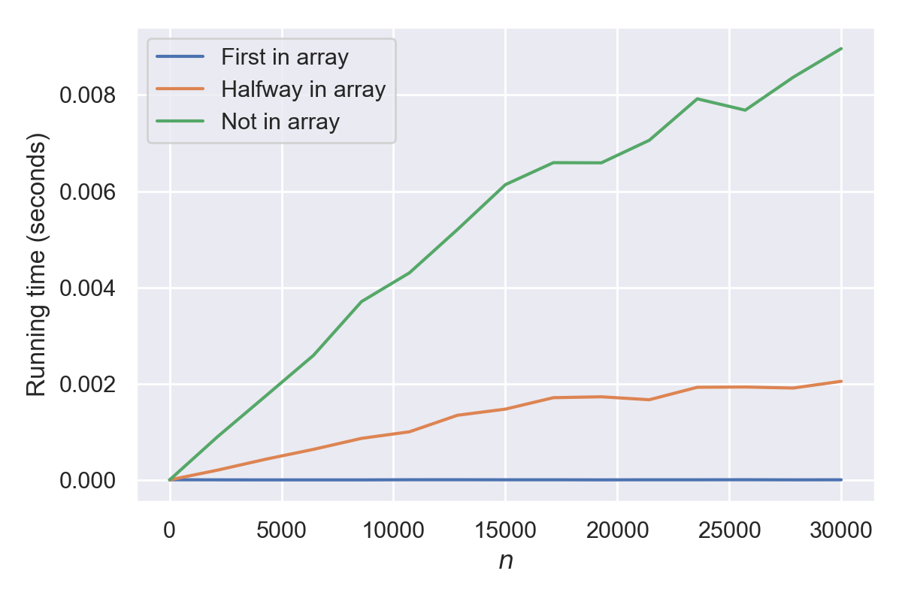

<blockquote class="important"> <strong>Update 7 May:</strong> As <a href="https://www.reddit.com/r/programming/comments/germth/a_guide_to_big_o_notation/fprpnl6?utm_source=share&utm_medium=web2x">pointed out by the user quicknir on Reddit</a>, an earlier version version of this article had some misleading statements. These have been corrected.
</blockquote>

You have probably come across big O notation before. Maybe you have read that merge sort is better than insertion sort because merge sort is $O(n \log{n})$ compared to insertion sort, which is $O(n^2)$. In this article, you'll understand what this means, and why this makes merge sort the better algorithm.

> ### Prerequisites
>
> I'm going to assume that you are at least vaguely familiar with functions (i.e. mathematical objects that take an input and produce an output), and exponentiation (like $n^2$).
> I'll mention logarithmic functions a few times, but a deep understanding is not required.

## Running time

In computer science, one of the things big O notation is used for is to describe how long an algorithm takes from start to finish.
This is know as the running time of the algorithm.

You might think that we could just use normal units of time for this, like saying how long it takes in milliseconds.
However, this depends upon more than just the algorithm: What hardware are we running on?
What language is it written in? How is the input encoded?
Saying that computing a value takes 20&nbsp;ms on a supercomputer isn't very helpful when I'm on a laptop.
We want a measure that is independent of which computer we have, and only depends on the algorithm itself.

The solution is to count operations.
An operation is a simple instruction to the computer.
Adding two numbers is an operation, so is comparing two numbers to see if one is bigger than the other.
Subtraction, multiplication and division also counts as operations.
If I know that two algorithms solve the same problem, and one of them requires 50 operations, whilst the other requires 5000, one of them will obviously be faster than the other.

The number of operations required to solve a problem will very often depend on how big our problem is.
Sorting a list of ten numbers will require fewer operations than sorting a list of 10&nbsp;000 numbers.
Yet, we may use the same algorithm to sort both lists, so we need to use the size of the input to specify how many operations we nee.
This is where the $n$ part of $\mathrm{O}(n)$ comes in: $n$ is the size of the problem.

When using a function to describe the _exact_ number of operations an algorithm requires, this function is often called $T(n)$.
I don't really know why, but I'm guessing it's $T$ for time.
Don't worry, we'll get into the difference between $T(n)$ and $\mathrm{O}(n)$ next.

> The precise meaning of $n$ is highly dependent on the kind of problem. It could mean the length of an array, or it could be the number of vertices in a [graph](<https://en.wikipedia.org/wiki/Graph_(discrete_mathematics)>).
> Most of the time, it will be obvious from context, and in the cases where it isn't, let's hope someone takes the time to explain it.

## In it for the long run

The $\mathrm{O}$ part of $\mathrm{O}(n)$ indicates that we aren't very concerned about specific values of operations. We are mainly concerned with how this number of operations grows as $n$ grows larger. In fact, $\mathrm{O}(n)$ isn't just _one_ function, it describes a family of functions. A function $T(n)$ is $\mathrm{O}(n)$ if $T(n)$ grows no faster than the function $n$ does as $n$ gets very large. If it grows no faster than $n^2$, it is $\mathrm{O}(n^2)$. Note that if a function is $\mathrm{O}(n)$, it is $\mathrm{O}(n^2)$; if it grows no faster than $n$, it certainly grows no faster than $n^2$ as well. However, we usually try to pick the tightest boundary possible: That is, we try to pick the slowest-growing function possible as an argument for $\mathrm{O}$. The argument to big $\mathrm{O}$ can be any function.

For instance, consider the following plots:


Even though function $A$ is smaller than function $B$ when the problem isn't very big, this changes very quickly as the problem size increases. If you were implementing some algorithm where you don't know the size of the problem in advance, you would want to go for function $B$.

This is probably a good time to introduce some friends of $\mathrm{O}$: Omega $\Omega$, and Theta $\Theta$.

- Big $\Omega$ is like the opposite of big $\mathrm{O}$: A function is $\Omega{(n)}$ if it grows faster than $n$.

- Big $\Theta$ is somehow in-between: A function is $\Theta(n)$ if it grows _like_ $n$ in the long run.

This is all a bit hand-wavy, and the mathematical definitions of $\mathrm{O}$, $\Omega$ and $\Theta$ are more precise than the way I've stated it.
For our purposes this doesn't really matter.
The important part is that they are all about how fast a function grows.

## At least it can't get any worse

A common misconception is that big $\mathrm{O}$ will always refer to the worst case of an algorithm, and $\Omega$ will always refer to the best case. This is not true: The running time of an algorithm may be described with whichever of big $\mathrm{O}$, $\Theta$ and $\Omega$ is most fitting. If we don't know how slow an algorithm might get, but we know that it's never faster than $n^2$, we would use $\Omega(n^2)$.

If you have the knowledge required to use the $\Theta$ notation, do it! Big $\mathrm{O}$ only serves to provide an upper bound. The true growth may be much slower than what $\mathrm{O}$ tells us.

## Keep it simple

If you have seen examples of big $\mathrm{O}$ in the wild, you might have noticed that the examples are always fairly simple:
It is always something like $\mathrm{O}(n^2)$, never something more complicated like $\mathrm{O}(2n^2 + 3n + 2)$.
This is a feature, not a bug.
Because we only care about growth, we can drop things that don't influence this as the input to the functions become large.
Take another look at the above input to $\mathrm{O}$: $2n^2 + 3n + 2$. Consider what happens to each term if we double $n$. The last term, $2$, doesn't grow at all.
The second term, $3n$ will double in size.
The first term, $2n^2$, will quadruple.
As $n$ gets very large, this means the first term will completely dominate, and the function will "grow like" $n^2$.

This is a plot of $2n^2 + 3n + 2$ and $n^2$ with $n$ from 0 to 5:


And this is a plot with $n$ from 0 to 1000:


Sure, the original function is bigger, but relatively, they both grow in a similar fashion.

This is also why we don't care about constants.
They don't change the rate of growth of a function, so we drop them.
If a function takes a constant amount of time, maybe requiring 1000 operations no matter the size of the input, it is $\Theta(1)$.
The number 1000 grows at the same rate as the number 1 when the input size is increased—that is to say, it doesn't.

> Often, you will see something like $T(n) = \mathrm{O}(n)$.
> This is a slight abuse of the equality sign, as we're not saying that our one function $T$ is the same thing as the collection of functions that $\mathrm{O}(n)$ represents.
> What we mean is just that $T$ belongs to this family.
> Strictly speaking the correct symbol for this is $\in$, as in $T(n) \in \mathrm{O}(n)$, but the equality sign is used so often that by this point, it is convention.

By now, it should make sense what it means when you read that insertion sort is $\mathrm{O}(n^2)$. Translated into plain English, this means that as the input size to insertion sort grows to be very large, the number of operations required to sort the input increases by no more than the square of the increased input size, maybe times some constant factor. Merge sort is better because this algorithm is $\mathrm{O}(n \log{n})$, and this grows slower than $n^2$.

## Adding run times

Often we will solve a problem by using several algorithms, one after the other. Let's say we use two algorithms: Algorithm $1$ with a run time belonging to $\mathrm{O}(n^3)$, and algorithm $2$, where we're not really sure about the run time, but we know it's no better than $n$, so it belongs to $\Omega(n)$. To find the total runtime, we need to solve

$$
T(n) = \mathrm{O}(n^3) + \Omega(n).
$$

It might surprise you to learn that the solution is $\Omega(n)$.
To understand why, try to think of the terms as lengths that are bounded either from above or below.
We don't know how long the first length is, but it is no longer than $n^3$.
We also don't know how long the last length is, but it is no shorter than $n$.
Adding them together we don't really know a whole lot, except that the result has to be longer than $n$ as well.

For a similar reason, combining two algorithms where one is $\mathrm{O}(n^3)$ and the other is $\mathrm{O}(n^2)$ will result in a running time that is $\mathrm{O}(n^3)$. The faster growing term dominates.

## Space-time

Even though I have only referred to running times so far, big O notation can be used to describe any mathematical function. Another popular use for the tool in computer science is for classifying not only how long an algorithm takes, but also how much memory it requires.
The former is referred to as time complexity, whilst the latter is called space complexity.
I won't go any further into it here, as the rules for the notation itself are exactly the same.

## Summary

- The notations $\mathrm{O}$, $\Omega$ and $\Theta$ all describe how fast a function grows as its input gets very large.
  - $\mathrm{O}(n)$ means the function grows no faster than $n$.
  - $\Omega(n)$ means the function grows no slower than $n$.
  - $\Theta(n)$ means the function grows like $n$.
- When using Big O notation, we drop all constants in front of terms.
- When using Big O notation, we only care about the term that grows faster and drop all others.

## Examples

Let's try to actually find the runtime of a few algorithms. All of them will process arrays, and $n$ will refer to the length of the array. For instance, if the array is `[1, 5, -2]`, we will have $n=3$. For each of them, I will also include a plot of how the execution time varies with input size on my computer.

---

```py
def sum_of_first_two_elements(arr):
    return arr[0] + arr[1]
```

In the above function, we are always doing the same thing: Get the first two elements, add them together, and return the result.
No matter how long the array is, this won't change (unless the array only contains one element and we get an error, but let's ignore that).
This means that the best, average, and worst case are all the same.
The runtime is $\Theta(1)$.


---

```py
def sum_of_array(arr):
    total = 0
    n = len(arr)
    for i in range(n):
        total += arr[i]
    return total
```

This is a little more involved.
We are iterating through the entire list, and tallying up the total. We need to create a counter variable, then go through everything, and finally return the value.
Creating a variable takes a constant amount of time, but we need to tally up every item in the array—all $n$ of them.
The runtime is $\Theta(n)$.


---

```py
def get_index(arr, value):
    n = len(arr)
    for i in range(n):
        if arr[i] == value:
            return i
    return None
```

This function will search an array for a given `py›value`.
If any element matches the value we are looking for, the function returns the current index.
If we go through the whole array without finding the correct value, we return `py›None`, indicating the value isn't in the array.
This means that we might get to quit early when we are looking for something that happens to be in the front of the array, or we might be unlucky and look for something that isn't there.
In this case, we would have to look at all elements, and if the length of the array doubles, we have to look at twice as many elements.

This algorithm have different running times for the best and worst case scenarios. In the worst case, the value isn't in the array, and we have to check all $n$ elements. Then the running time is $\Theta(n)$. In the best case our value is the first element, and the running time is $\Theta(1)$.

If we want to encapsulate both of these runtimes using a single notation, we'll have to use $\mathrm{O}(n)$: The runtime might grow like $n$ at most, but it might be slower as well. Using $\Theta(n)$ for the general runtime would be incorrect, as in some cases, the runtime doesn't grow at all for longer inputs.

If we assume the value we are looking for is always in the array, and it's equally likely to be anywhere in the array, we'd expect to have to go through half of the array on average—half of the time we'd find it earlier, half of the time we'd have to go longer. This means the runtime would be approximately $T(n) = n/2$, but remember that we don't care about constants! The average runtime is still $\Theta(n)$.

The plot below shows three scenarios: One where `py›value` is always the first in the list, one where it is in the middle, and finally, one where it isn't there at all.



---

```py
def sum_of_everything_multiplied_with_everything(arr):
    n = len(arr)
    result = 0
    for i in range(n):
        for j in range(n):
            result += arr[i] * arr[j]
    return result
```

Ignoring the fact that this function is useless, notice the nested loops.
For every element in the array, we are iterating through the entire array, requiring $n$ operations for every loop.
The total running time is $\Theta(n^2)$.


The code used to produce all of the figures plots for this article is available on [Github](https://github.com/jakobsen/eaj.no/tree/master/content/posts/big-o-notation/big-o-plots.py).
